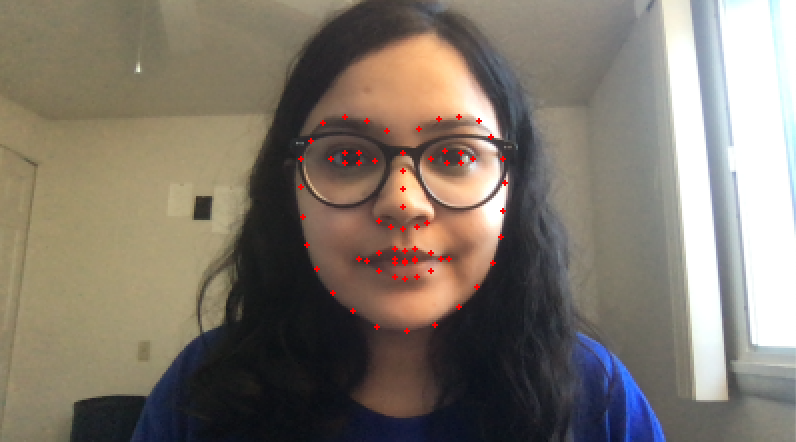
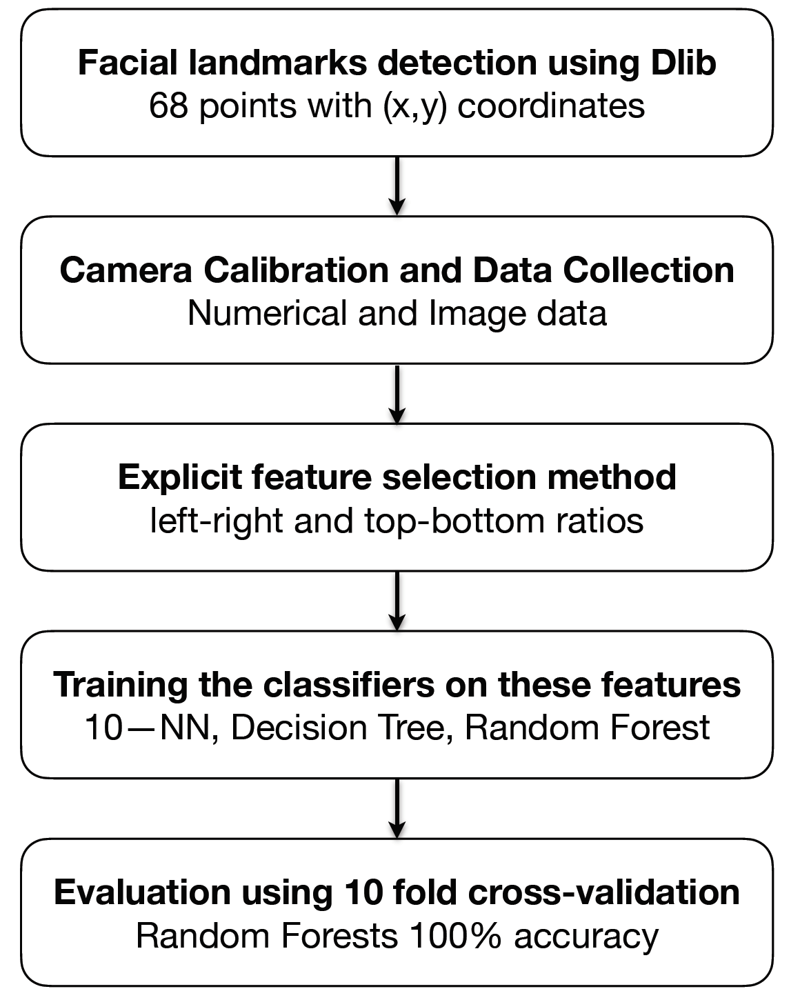

Paralysis is the loss of voluntary muscle control in which a person loses the ability to communicate using his or her limbs.
In some cases of paralysis, such as pseudocoma, a person loses his or her abilities to speak also. This project examines the issues and
approaches in developing a human-computer interaction system for people who can control the interface using their neck muscles.
An initial design of the system is built using the facial landmark points extracted using Dlib and OpenCV. Different classifiers
are compared like Decision Trees, Random Forests, K—Nearest Neighbors and Neural Networks, using explicit and automated feature
selection techniques. This project makes a small contribution in the independence of paralyzed people.

Facial landmarks are detected using Dlib as shown in the figure:

The system works as follows:

After comparing different classifiers using manual features as well as autoencoders with automated features, 
the Random Forests achieved a 100% accuracy in predicting where a subject is looking on a 3-by-3 grid on the screen.

An initial design of a head-controlled human-computer interaction system is thus built.
